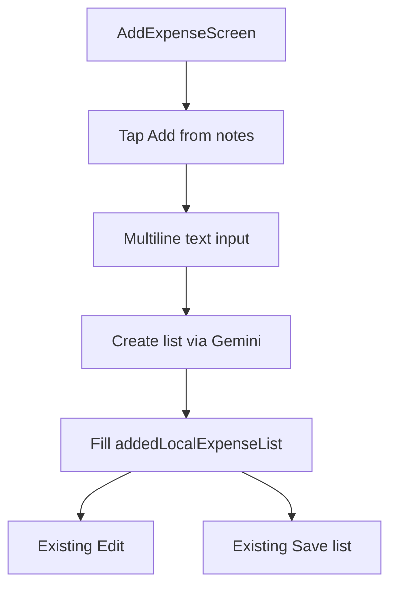

# Add from notes

Parse a free-text note into expense rows on the Add Expense screen. The user can edit the rows, then tap **Save list**.

Button label: **Add from notes** (not “Add With AI”).
Parse action: **Create list**.

## Why this name

The user is pasting a note. The button should name that action, not the model.

---

## Why not Remote Config for the API key

Remote Config works on Spark, but it is **not a secret store**. A Gemini key would still land on the device after fetch.

Use **Firebase AI Logic + Gemini Developer API** instead.

- Same Firebase project (Auth + Realtime Database)
- No Gemini key in the app, git, or Remote Config
- No Cloud Functions (those need Blaze)
- [Firebase AI Logic pricing](https://firebase.google.com/docs/ai-logic/pricing): Gemini Developer API free tier stays on Spark

Remote Config is optional later for model name or prompt tweaks, not for keys.

---

## User flow



Example input:

```
electric bill 500 Aspire
home rent 10000 Aspire
egg, milk 200 7-11
```

The model fills `name`, `price`, `type`, `place`, `city`, `country`.
`type` is required by the existing form.

Parsed rows go into `addedLocalExpenseList` in:

- [AddExpenseScreen.swift](../../ExpenseTracker/ExpenseTracker/Presentation/Tabs/AddExpense/AddExpenseScreen.swift)
- [AddExpenseViewModel.swift](../../ExpenseTracker/ExpenseTracker/Presentation/Tabs/AddExpense/AddExpenseViewModel.swift)

No new save path. Existing **Edit** and **Save list** stay as they are.

---

## Context window: previous month start through today

**Decision:** fetch every expense list from **the 1st of last month through today**, then send a **compact unique summary** to Gemini. Do not write a separate JSON file.

Example: if today is 15 May, fetch **1 April → 15 May**.

That covers a full previous calendar month plus the current month so far. Recurring items like rent and bills still show up even if they were logged early last month.

### Why a JSON file is worse

The app already caches Firebase on disk:

- `Database.database().isPersistenceEnabled = true` in `AppDelegate`
- `ref.keepSynced(true)` on `users/{uid}/expenseLists`

A second JSON copy would:

- Duplicate data already on disk
- Go stale after add / edit / delete unless every write path updates it
- Risk sending Gemini the wrong place, city, or type
- Add file I/O, schema, and invalidation with no real gain

`getRecentExpenseLists` is often served from the local Firebase cache. It is not a full network round-trip every time.

### What to send Gemini

Do **not** send full lists. Build a small unique set, for example:

```json
[
  { "name": "home rent", "place": "Aspire", "city": "Bangkok", "country": "Thailand", "type": "Housing" },
  { "name": "egg", "place": "7-11", "city": "Bangkok", "country": "Thailand", "type": "Grocery" }
]
```

That is enough for the model to fill place, city, and country.

### How to fetch (without breaking History)

Use `getRecentExpenseLists` in [FirebaseRealtimeDBUseCase.swift](../../ExpenseTracker/ExpenseTracker/Domain/UseCase/FirebaseRealtimeDBUseCase.swift).

**Do not** call `getLatestExpenseLists` from Add Expense. That mutates `lastFetchedDataKey` and breaks History paging.

Filter by `dateTime` (`yyyy-MM-dd'T'HH:mm:ss`):

- Start: `00:00:00` on the 1st of the previous calendar month
- End: now

Keep fetching recent lists until the oldest list is before that start date (or there are no more). Then drop anything outside the window. Do not use a rolling 30-day cutoff.

### Optional in-memory cache (if fetch feels slow)

Keep the compact unique summary in memory on `AddExpenseViewModel` for the session.

- Build it on first **Create list**
- Refresh after a successful **Save list**
- Drop it on sign-out

That is better than a JSON file: no extra persistence, still up to date after save.

---

## Firebase console (once)

Goal: stay on **free** resources (Firebase Spark + free Apple Personal Team). Do not use DeviceCheck or App Attest yet.

1. Firebase console → **AI Logic** → Get started
2. Choose **Gemini Developer API** (Spark)
3. Enable App Check for AI Logic (required as of July 2026)
4. Use the App Check **debug provider** for Simulator **and** a physical iPhone

### Why skip DeviceCheck / App Attest for now

Those need a paid Apple Developer Program membership (~$99/year). A free Personal Team cannot finish Firebase’s production App Check setup:

- **App Attest** needs an explicit App ID and the App Attest capability. A Personal Team only gets wildcard App IDs. Adding App Attest in Xcode fails provisioning.
- **DeviceCheck** needs a `.p8` key from Certificates, Identifiers & Profiles. Free accounts do not get that portal.
- Firebase’s Apple App Check providers also need Team ID / key material from that portal.

### Debug provider on a physical iPhone (free)

Firebase documents this for simulator **or** a test device. Reuse the same debug factory as the simulator.

1. In `AppDelegate`, call `AppCheck.setAppCheckProviderFactory(AppCheckDebugProviderFactory())` **before** `FirebaseApp.configure()`. Use this for all DEBUG builds (simulator and device).
2. Run from Xcode with the free Personal Team. First launch prints a debug token in the Xcode console, for example `App Check debug token: '…'`.
3. Firebase console → App Check → your iOS app → **Manage debug tokens**. Register that token.
4. Simulator and device each get their own token. Register both if you use both.

Do not commit debug tokens. Do not ship `AppCheckDebugProviderFactory` in an App Store or TestFlight build.

A Personal Team install expires after about a week and must be reinstalled from Xcode. After the token is registered, later launches of that debug build still work without Xcode attached.

When you later join the paid program and ship, switch Release to App Attest (iOS 14+) or DeviceCheck, and keep the debug factory only in DEBUG.

---

## App changes

### 1. SPM: `FirebaseAI` + `FirebaseAppCheck`

Same `firebase-ios-sdk` 12.3.0. Add products `FirebaseAI` and `FirebaseAppCheck` in the Xcode target (same pattern as Auth/Database in [project.pbxproj](../../ExpenseTracker/ExpenseTracker.xcodeproj/project.pbxproj)).

Initialize App Check in [AppDelegate.swift](../../ExpenseTracker/ExpenseTracker/AppDelegate.swift) **before** `FirebaseApp.configure()`:

- DEBUG (simulator and physical device): `AppCheckDebugProviderFactory`
- Release / App Store: App Attest or DeviceCheck — **out of scope** until a paid Apple Developer account exists. Do not add those capabilities now.

### 2. Use case: note text → `[Expense]`

New `Domain/UseCase/GeminiExpenseParseUseCase.swift`:

- `FirebaseAI.firebaseAI(backend: .googleAI())`
- Model: `gemini-3.6-flash` (constant in `Constants`)
- `generateContent` with JSON schema (`responseMIMEType: application/json`):

```json
[{ "name": "home rent", "price": 10000, "type": "Housing", "place": "Aspire", "city": "Bangkok", "country": "Thailand" }]
```

- Prompt: user note + compact unique summary from 1st of last month through today
- Assign client-side `id` (timestamp + index or UUID), same idea as [ExpenseInputViewModel](../../ExpenseTracker/ExpenseTracker/Presentation/ExpenseInput/ExpenseInputViewModel.swift)

### 3. ViewModel + UI

`AddExpenseViewModel`:

- `notesInputText`, `isShowingNotesInput`, `isParsingNotes`
- `createListFromNotes()`: fetch/build compact context → parse → append to `addedLocalExpenseList` → update `currentTotal`
- Errors via existing `alertView`

`AddExpenseScreen`:

- **Add from notes** button near the form (same `TextButtonStyle` as Save list)
- Sheet or expandable `TextEditor` + **Create list** / Cancel
- Progress while parsing
- After success, dismiss input; show the existing list, Edit, and **Save list**

Keep manual `ExpenseInputView` so users can mix form rows and note-parsed rows.

---

## Out of scope

- Changing how lists are posted to Firebase
- Rewriting Edit
- Cloud Functions / Blaze
- A local JSON file of previous-month-to-today expenses
- Paid Apple Developer Program, App Attest, DeviceCheck, TestFlight, App Store

## Implementation todos

1. Add FirebaseAI + FirebaseAppCheck; init DEBUG App Check with `AppCheckDebugProviderFactory` in AppDelegate before `FirebaseApp.configure()`
2. Add `GeminiExpenseParseUseCase` with structured JSON output and compact context from 1st of last month through today
3. Wire **Add from notes** input, **Create list**, loading, and append into `addedLocalExpenseList` + Save list
